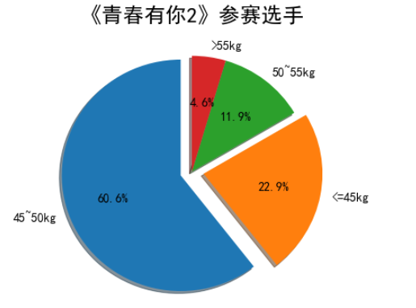
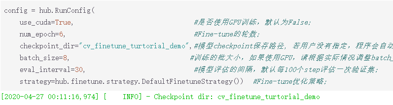
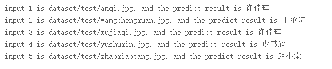
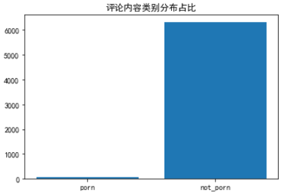

 ## 结营心得体会

&ensp;&ensp;&ensp;&ensp;从第一天的python入门起，我就对python心有好感，本地环境的搭建，由于是使用windows操作走了很多弯路，
在一周前有幸得知百度AI正在举办《Python小白逆袭大神》的训练营，我也来参加，对于个人也是一种能力上的提
升，这七天学下来，也看到群友反映，这课程对于毫未接触过python的人来说还是有难度的，就如python的面向对
象编程不可能在半日内消化完毕，但在之后课程学习及作业中，许多大的框架都已搭建好了，群友们讨论声异常热
烈，对问题的研究十分到位，在此中收获了不少，以下是对每天的学习进度的感悟。  
  
&ensp;&ensp;&ensp;&ensp;在第一天学习中，可能我自己页算是对python稍有了解，作业完成也是比较轻松，和群友讨论也比较自在，就
如作业中乘法表的制作，我想弄的花操作，但想到python本该就是简洁，优雅的特性，还是中规中矩的使用for循环
进行书写，对于遍历文件并找出符合条件的文件，当时想就是使用`os.listdir`简单的遍历一个个的文件夹，然后在
各个文件夹中查找，可发现操作台繁琐，一点也不python，于是去网上冲浪，发现还有`os.walk`，使用该函数完成了
作业，遗憾的是在之后的一天我发现还有一个更好的内置模块`glob`，没有在这次作业中使用，但我在之后的作业中使
用了该模块，虽然代码量只减少了4行，但对于我来说足以记住这个函数，毕竟代码量与发量成反比(hhh)。  
  
&ensp;&ensp;&ensp;&ensp;七天的打卡营，每天都有作业发布，第二天的作业对比第一天的难度可以说是上升了不知一个难度点，使用爬虫
对选手信息进行爬取，心想爬虫我之前有用到过，而且自己也爬过数据，这一次作业的难度也不算啥，然后就跳过了
教学视频的观看，直接写作业，好家伙，模块中就引用了json数据处理，`BeautifulSoup`解析，什么数据要用两个家
伙一同操作仔细的去看作业的实际要求，也自己打开索要爬取的网站去找节点，虽说之前学爬虫的时候知道`bs4`比`Xpath`
和正则简单易懂，但那时为了偷懒只学了`Xpath`解析，为当初的偷懒留下了悔恨的泪水，往后由于`re`模块在其他方面用
的较多，又学习了`re`，难道这时要临时再学一手bs4，时间紧迫，还是再看一眼作业要求，一个个对照网站的节点位置，
最终发现用`Beautiful.find`就能解决，差点就要甩出我的Xpath。作业提交，Over。  
附一张爬取到的小姐姐的图:  
  
&ensp;&ensp;&ensp;&ensp;第三次作业算是简单，使用`matplotlib.pyplot`作饼图，由于有中文字符，需要额外的操作是中文正常显示，好在
作业中已给出解决方案，这个方案在最后一次作业中也有帮助，绘图过程中，根据老师的绘图模板，了解给定数据集中
各个字段的意思操作起来还是方便，唯一困扰的地方就是，数据分组是不是要包括右端点部分及方法的调用，考虑使用
过`bisect`模块，再用`pandas.apply`方法使用起来不要太简单，但最终确定需要用包含右端点部分，就还是用`pandas`中`cut`
方法，并且需要进行子符串转数值型操作，之后的饼图操作比较简单，字体设置，储存，提交。  
结果展示:  
  
&ensp;&ensp;&ensp;&ensp;第四次作业可以说是这几天作业中最难的部分，相信打卡营的小伙伴大部分都在这个部分花了大量的时间，而且主办
方页因此延迟了此次作业的提交时间，上天再给我续一天，我再来调优，但已经不可能，具体原因不可描述(hhhh),在这
次作业中有一个演示模板，是一个二分类预测识别，由于这是我不知道的地方，跟着上面给出的方法一步步的进行，导包，建模，迁移训练，
嗯，怎么预测失败了？于是想在网站上操作可能太慢了，使用gpu需要等待，于是就在本地搭建环境，windows搭建gpu环境是真的难，
原以为只要简单的导库就行了，发现还要下载相应的CUDA模块，看着一会2G流量就没了，要是成功了就还好，可惜没有，也需是手法问题，
在几经操作后环境搭建成功，浪费了6g的流量，想着月末了还不捞捞运营商的钱，就无所谓了，下载模块，迁移训练，OH，我的天，哪又有问题了，
夜色太美，看着我这重启又重启的小笔记本，喝了一口凉白开，关掉电脑。第二起来，赶紧看看AI-Studio里的gpu环境可不可以用，还好起的早，
在这个环境里调试，然后百度问题点，再看看讨论区有没有相同问题，没有，自己解决。终于到作业部分了，数据集及模型调优是自己做，简单来
说，给我一份好的数据集，我给你一个完美的数据预测方法，数据集是引用第二天爬虫爬取的图片，试了下，只能准确预测两个，我怀疑模型是否
也是在猜呢？小数据集当然不行，想想之前有用过PIL模块进行图片的处理，可以进行数据增强，在本地实验了下，可以，上传数据集，为我当时的
无知记录，正确做法应该是上传源数据集，在平台做增广操作的(捂脸)，整体数据集对于模型来说还是太小，但经过调优可以准确识别出4个小姐姐，
开心，但此时，我还是觉得不太好，当然全部都能预测出才好啊，一顿花里胡哨的操作，版本生成后，原始版本居然不见了，作罢。提交这个版本，
看到群里有人讨论文档存储位置错误，找不到，经过几番操作及处理，把给定的path路径改了，我这个就能正常运行了。（我真是个小精灵鬼） 
预测配置策略:  
   
预测结果:  
  
&ensp;&ensp;&ensp;&ensp;最后一次作业，可谓前几天所学的所有知识都会在这里使用，老师在视频中也讲解了注意事项及一些重要模块的编写，
在这一次作业中，模块是给定的，但我的想法和老师要我们写内容大不一样，但结果呈现出来应该没有问题吧。由于要制作词云图，需要下载`jieba`和
`wordcloud`模块，中文字体的正常显示，将第三天中文字体设置照搬过来，具体还有`paddlehub`的模块下载及检测内容类型，对于各个模块中，时间最近，
记得也清楚，可以对每个模块都说说，请求爱奇艺评论接口，通过网站url的翻找，找到评论接口(get_comment...)，多次对比及测试，发现并不用
lastId返回调用，使用`page`和`page_size`暴力翻页遍历爬取，page_size为一页显示多少个评论，默认30，最大不超过40，这里自定义为40，`page`为第几页
最小为1，在我所爬取的视频的评论最大为249，这里选取最大至200，爬取大约有8000条，有部分评论为空值，这里使用异常处理滤除，保证程序的正常运行，
最终评论url构造为:  
```python
url = f'https://sns-comment.iqiyi.com/v3/comment/get_comments.action?agent_type=118&business_type=17&content_id=15535228800&page={i}&page_size=40'
``` 
视频url为:  
```python
'https://www.iqiyi.com/v_19ryfkiv8w.html#curid=15068699100_9f9bab7e0d1e30c494622af777f4ba39'
```  

爬取到的评论为json数据，还需要调用json模块进行处理，处理代码如下:  
```python
response = res.json()['data']['comments']   # res为函数传入的json数据
arr = []
for i in range(len(response)):
    try:
        arr.append(response[i]['content'])
    except KeyError as k:  # 对没有评论的字段做异常处理
        print('该用户未评论')
```  

&ensp;&ensp;&ensp;&ensp;直接进行分词处理的话间会发现词云图会将一些任命切开，所以需要增加固定词，作业中给的停用词是这个吗？海有去除停用词模块，因为，我在处理分词模块时，停用词和固定词直接一并处理了，所以将迆给的去除停用词改成了单独的词频计数模块，选出<font color="red">topN</font>，可能会有更好的方法，我使用这个方法时发现没有导入包，
自己将包导入，模块使用:  
```python
from collections imort Counter
counts = Counter(text)  # text为列表
most_topN = dict(counts.most_common(N))   # 选出topN词频
```
&ensp;&ensp;&ensp;&ensp;这次作业中还有个较为难的点，由于我我之前使用过python的其他模块进行抠图，这次换成`paddlehub`抠图，用法类似，这个更为简洁，若在本地安装成功了，我也会更偏向于使用`paddlehub`来进行抠图及背景的转换，对于一个由抠图经验和使用过`wordcloud`的人来说，使用蒙版图绘制有图案的词云图不难，因为看法哦群里有些小伙伴遇到一些底图的制作问题，这里也将代码贴出来，希望可以帮助其他人:  
```python
# 导入抠图模块
import paddlehub as hub
module = hub.Module(name="deeplabv3p_xception65_humanseg")
# 载入要抠的图片
result = module.segmentation(data={"image":["work/wordcloud_img.jpg"]})  # 需要将路径换掉
img_path = result[0]['processed']    # 读取抠图后图片存放路径，就避免自己去找啦

# 将底色换成白底，使词云图正常展示
image = Image.open(img_path)  
img = Image.new('RGB', image.size, (255,255,255))   # 自己画一张白色的图片
img.paste(image, (0, 0), image)
img = np.array(img)   # 转换成二进制，方便wordcloud使用

# 词云图制作
wc = WordCloud(font_path="simhei.ttf", background_color='white', scale=2, 
                 min_font_size=10, max_font_size=100, width=400,
                 mask=img, stopwords=stopwords, relative_scaling=0.3)
wc.generate_from_text(','.join(text))

# 保存
wc.to_file('pic.png')
```
&ensp;&ensp;&ensp;&ensp;其余还有的话，就是`paddlehub`的`porn_detection_lstm`内容分析，初以为是分析评论的喜怒哀乐，害的我看好多评论都是负面评论啊，细思恐怖，去翻看之前爬取的评论也没发现大量的消极评论啊，难道模型是这样设置的？最后听老师讲解，是分析内容是否低俗，各内容类型占比如下:  
    
最后的词云展示:
  
    
    
